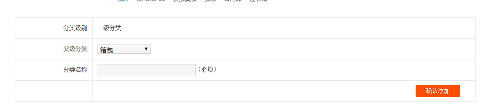
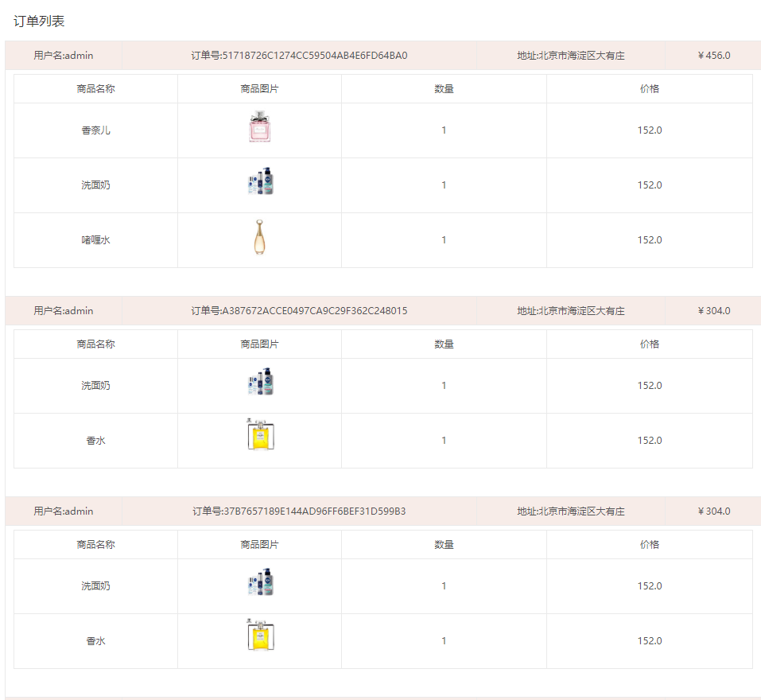

# 易买网-EasyBuy#

## 一、概述##

随着互联网的迅速普及，各式各样的网络购物也随之非常火爆，如淘宝网、京东商城等，这些购物网站可以满足我们日常工作和学习中的基本需求。易买网也正是在这种趋势下应运而生的。易买网提供了很多商品，用户可以在线进行**浏览商品、选购商品、将物品加入购物车、生成订单、查看订单**，并可以**后台管理相关数据**

。易买网采用**B/S架构**,包括**前端网站展示**及**后台数据管理**两大功能。详细功能列表，如图1所示。

 

 

图1 易买网功能图


开发者：**潘韬**

Github地址: 

## 二、开发环境##

- 操作系统：Windows 10 Enterprise
- 开发工具：Intellij IDEA
- 数据库：MySQL 8.0.16
- Java SDK：Oracle JDK 1.8.181
- 项目构建：Maven
- 插件：Lombok、MyBatisCodeHelper


## 三、部署环境##

* 配置 ：阿里云ECS服务器(1核2G内存40G高效云盘)
* 操作系统：Linux Ubuntu Server 18.04 X64
* 容器化技术：Docker
* 负载均衡：Nginx
* 项目地址：[http://www.ekko.xyz]


## 四、主要技术栈

- 核心框架：Spring Boot(AOP、IOC、WebMVC注解、自动化配置、依赖管理、事务、拦截器、过滤器、MD5加密)
- ORM 框架：TK.mybatis 简化 MyBatis 开发
- 数据库连接池：HikariCP(光)
- 模板引擎：Thymeleaf
- 前端技术：HTML、JavaScript(JQuery)、CSS
- 前后分离技术：AJAX

## 五、前台功能##

### 1．首页页面###

* 首页中左侧边栏为商品一级分类,鼠标滑过一级分类会展示其二级分类和二级分类下的三级分类。
* 首页的右边展示的是易买网最新的5条资讯信息。
* 首页的正中央是一个轮播图的展示。
* 首页的下方展示的是每个分类的部分推荐商品。

首页页面效果如图2、3所示。

 

图2　易买网首页页面1 

​    

图3　易买网首页页面2

### 2．用户注册###

* 易买网对所有游客和会员都提供浏览商品,和选择商品加入购物车的功能。
* 如果用户需要对购物车的物品进行结算，则首先需要注册成为易买网会员。
* 注册时用户登录名不能重复。

用户注册页面效果图如图4所示。

 

图4　易买会员注册页面

 

### 3．用户登录###

在用户结算购物车前，需要首选进行登录，登录页面如图5所示。

 

图5　用户登录效果

### 4．资讯动态###

热点资讯是在首页右侧类似淘宝公告栏的一个区域，在该区域中

* 系统将会以列表方式显示前5条最新资讯，如图6所示。

 

图6　首页资讯展示效果

* 用户可以点击更多,查看更多资讯资讯，图7所示。

 

图7　更多资讯展示效果

* 用户还可单击相关资讯链接查看资讯详情，如图8所示。

 

图8　资讯详情页展示效果

### 5．商品列表展示###

鼠标滑到首页中的一级分类，将显示其二级分类和二级分类下的三级分类。点击相关分类，系统将使用分页的方式展示其分类下的所有商品。用户可以点击收藏将物品添加至自己的收藏夹，也可以点击加入购物车将物品加入自己的购物车，如图9所示。

 

图9　分类商品信息展示页面

### 6．商品详情页面###

* 单击某一商品图标或者商品名称，系统进入商品详情页面，用户可以浏览商品相关信息,并可以将商品加入购物车,如图10所示。


 

图10　商品详情页展示页面

### 7．购物车###

当用户选择完商品之后，可以进行以下操作

* 点击查看自己的购物车中相应的商品。,
* 对选择的物品数量、种类进行删改。
* 当用户确定商品信息后,可以点击确认结算，进入订单确认页面。购物车效果图如图11,12所示。


 

图11　购物车清单页面

 

图12　购物车清单页面

### 8．收货地址###

用户进入订单确认页面后，可进行以下操作购物车效果图如图13所示。

* 点击修改商品,返回购物车列表页，对购物车内的物品进行维护。
* 选择收货地址。如果收货地址存在，则选择，不存在则可以选择新地址新增收货地址。
* 点击确认订单,系统生成购物订单。

 

图13　易买网选择收货地址页面

### 9.提交订单###

提交订单后，显示订单号，支付信息，快递信息。


## 六、后台功能##


当登录的用户身份为管理员时，可以进入后台管理页面，对相关的内容信息进行维护，包括以下内容。

### 1.用户管理###

对注册用户和自身信息进行管理，如图14所示。

 

 

图14　后台用户管理页面

用户修改页面与注册页面格式类似，如图15所示

 

图15　后台用户信息修改页面

### 2.商品管理###

商品管理包括商品管理和商品类别管理。

- 商品的管理：维护商品名称，库存，商品图片，商品类别,如图16、17所示。

 

图16　商品修改页面

​    

图17　商品维护页面

- 商品分类管理：系统中所有的商品分类分为三类，分别是一级分类，二级分类，三级分类（如:图书是一级分类，而少儿图书、青年图书则属于二级分类，0-3岁属于三级分类），商品分类管理包括对商品分类名称，级别等数据的维护。如图18所示。

​    

图18　商品新增分类页面



### 3.订单管理###

当用户在前台购物选择相应收货地址后，将购物车提交并形成一份订单。在后台管理端可以进行订单查询（根据订单号、订货人）如图19所示。（完成）

 

图19　订单管理页面

###4.资讯管理###

用户可以在后台查看资讯列表，并查看相关资讯明细。


## 附1：MD5加密##

Spring提供了专门对字符串，文本进行MD5加密的工具类DigestUtils,该类存在于**spring-core-x.x.x.jar**中，可以直接在系统引用。

```java
import org.springframework.util.DigestUtils;

public class MD5Test{
  public static void main(String[] args){
    String pwd = "123456";	// 密码
    String md5Pwd = DigestUtils.md5DigestAsHex(pwd.getBytes());	// 对密码进行 MD5 加密
    System.out.print(md5Pwd);	//e10adc3949ba59abbe56e057f20f883e
  }
}
```

